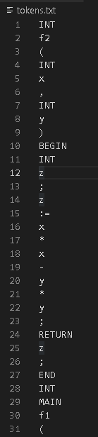
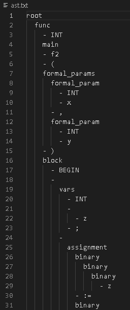
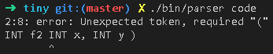

# TINY+

## 实验目的

扩充已有的样例语言 TINY，扩展 TINY 语言 TINY+ 构造词法分析和语法分析程序，从而掌握词法分析和语法分析程序的构造方法。

## 实验内容

了解样例语言 TINY 及 TINY 编译器的实现，了解扩展 TINY 语言 TINY+，用 EBNF 描述 TINY+ 的语法，用 C 语言扩展 TINY 的词法分析和语法分析程序，构造 TINY+ 的递归下降语法分析器。

## 实验要求

将 TINY+ 源程序翻译成对应的 TOKEN 序列，并能检查一定的词法错误。将 TOKEN 序列转换成语法分析树，并能检查一定的语法错误。

## TINY+ 语法

我在基础的 TINY 语法上，进行了几点改进：

1. 将程序 Program 扩充成函数 Func 和变量定义 Vars 的克林闭包。这样 TINY+ 语言允许定义全局变量

   `Program -> (Func | Vars)*`

2. 允许定义变量时，一条语句同一类型可以同时声明多个变量，比如 `INT a,b,c;`

   `Vars -> Type Id (',' Id) * ';'`

3. 允许字符串内转义，比如 `"a\tb"`  将表示 `a    b`。

4. 允许 8 进制（0 开头）、16 进制（0x 开头）的数字

   `Number -> NonZeroDigit Digits | NonZeroDigit Digits '.' Digits | '0x' HexDigits | '0' OctDigits`

下面是 TINY+ 语言的 EBNF：

```python
Program -> (Func | Vars)*
Func -> Type [MAIN] Id '(' FormalParams ')' Block
FormalParams -> [FormalParam (',' FormalParam)* ]
FormalParam -> Type Id
Type -> 'INT' | 'REAL'
Vars -> Type Id ( ',' Id )* ';'
Block -> 'BEGIN' Statement* 'END'
Statement -> Block | Vars | Assignment | ReturnStmt | IfStmt
IfStmt -> 'IF' '(' Expression ')' Statement [ 'ELSE' Statement ]
ReturnStmt -> 'RETURN' Expression ';'
ActualParams -> [Expression (',' Expression)*]
Unit0 -> '(' Expression ')' | CallExp | Number | Id | String | Char
Call -> Id '(' ActualParams ')'
Unit1 -> [('+' | '-')] Unit0
Unit2 -> Unit1 (('*' | '/') Unit1)*
Unit3 -> Unit2 (('+' | '-') Unit2)*
Expression -> Unit3 (('==' | '!=') Unit3)*
Assignment -> Id ':=' Expression ';'

Alpha -> 'a' | 'b' | ... | 'z' | 'A' | 'B' | ... | 'Z'
OctDigit -> '0' | '1' | '2' | ... | '7'
NonZeroDigit -> '1' | '2' | ... | '9'
Digit -> NonZeroDigit | '0'
HexDigit -> Digit | 'a' | 'b' | ... | 'f' | 'A' | 'B' | ... | 'F'

Id -> (Alpha | '_') (Alpha | Digit | '_')*
Number -> NonZeroDigit Digits | NonZeroDigit Digits '.' Digits | '0x' HexDigits | '0' OctDigits
HexDigits -> HexDigit | HexDigit HexDigits
OctDigits -> OctDigit | OctDigit OctDigits
Digits -> epsilon | Digit Digits
```

## 实验过程

### 词法分析器

词法分析器比较简单，可以通过硬编码的方式进行分词。每次新取一个 token，就需要分析第一个字符类型。

1. 如果第一个字符是数字，那么假定该 token 为数字，接下来根据数字的性质提取字符
   1. 如果第二个字符是 X，那么该 token 为 16 进制数字，接下来读取的字符在数字和字符之间皆可选
   2. 不是，且读取完数字和小数点后遇到了 E/e，那么该 token 为科学表示法的数字，读取 e 后，接受可选的正负号以及整数。
   3. 不是，且读取完数字和小数点后没有遇到 E/e，那么该数为一般的整数或小数，读取完数字和字符直到遇到了符号或空白字符等为止。
   4. 需要注意的是，存在 `1LL` 这种数字表示法，即数字末尾允许部分特定的字符出现，因此读取数字时必须要将末尾的字符一并划入同一个 token。
   5. 需要注意的是，存在 `1_000_000` 这种数字表示法，即允许数字被下划线隔开的情况，因此读取时也要允许下划线的存在。
2. 如果第一个字符是符号，那么根据符号表确认该符号是否可能为组合符号，如 `:=`、`==`、`!=` 这种 token 由两个符号组成，需要先查表确认第二个字符是否同样是符号且该字符在符号表中存在。
   1. 检查当前符号是否为 `/*`，是多行注释的起始符，那么需要一直读取字符直到遇到 `*/` 为止，再重新读取符号。
   2. 检查当前符号是否为 `//`，是单行注释的起始符，那么需要一直读取字符直到遇到换行符 `\n` 为止，再重新读取符号。
3. 如果第一个字符是字母或下划线，那么认定该 token 为关键字或标识符，那么接下来一直读取为字母、数字、下划线的字符，直到不是字母数字下划线为止。
4. 如果第一个字符是双引号 `"`，那么认定该 token 为字符串字面量，那么接下来要读取字符直到遇到了下一个双引号为止。
   1. 需要注意的是，字符串中允许转义，比如 `"\""` 表示只由一个双引号构成的字符串，那么该字面量中第二个双引号不是字符串的结束符。因此在解析字符串时需要记录当前字符是否被转义。
   2. 转义除了 `\b`、`\n` 这种，还有 `\x31`、`\u0031` 这种，在转义符 `\` 之后不止有一个字符，这种也要特别处理。额外的，还可以检查转义符是否有效，比如 `\y` 这种就是无效的转义符。

接下来就是使用代码实现上述规则。代码如下：

```c
int tiny_lex_next(tiny_lex_t *lex, tiny_lex_token_t *token)
{
    int c = tiny_lex_next_char(lex);
    while (isspace(c))
        c = tiny_lex_next_char(lex);
    if (c == TINY_EOF)
        return TINY_EOF;

    if (c != TINY_EOF)
    {
        token->s = lex->code + (lex->cur - 1);
        if (c == '"' || c == '\'')
        {
            int cur = c;
            bool escape = false;
            while (c = tiny_lex_next_char(lex), true)
            {
                if (c == TINY_EOF)
                {
                    return TINY_UNEXPECTED_EOF;
                }

                if (!escape)
                {
                    if (c == cur)
                        break;
                    else if (c == '\\')
                        escape = true;
                }
                else
                {
                    escape = false;
                }
            }

            int ret = parse_string_literal(token->s, lex->code + lex->cur);
            if (ret != 0)
                return ret;
        }
        else if (isdigit(c))
        {
            if (tiny_lex_peek_char(lex, 0) == 'x' || tiny_lex_peek_char(lex, 0) == 'X') // 16 进制
            {
                if (c != '0')
                {
                    return TINY_INVALID_NUMBER;
                }
                tiny_lex_next_char(lex);
                while (c = tiny_lex_peek_char(lex, 0), is_hex_digit(c))
                    tiny_lex_next_char(lex);
            }
            else
            {
                while (c = tiny_lex_peek_char(lex, 0), isdigit(c) || c == '.')
                    tiny_lex_next_char(lex);

                if (c == 'e') // 科学表示法
                {
                    tiny_lex_next_char(lex);                                  // 跳过 'e'
                    if (c = tiny_lex_peek_char(lex, 0), c == '+' || c == '-') // 跳过正负号
                        tiny_lex_next_char(lex);
                    if (!isdigit(c = tiny_lex_peek_char(lex, 0))) // 检查阶数是否合法
                        return c == TINY_EOF ? TINY_UNEXPECTED_EOF : TINY_UNEXPECTED_TOKEN;
                    while (c = tiny_lex_peek_char(lex, 0), isdigit(c)) // 提取阶数
                        tiny_lex_next_char(lex);
                }
                else // 普通数字
                {
                    while (c = tiny_lex_peek_char(lex, 0), isdigit(c))
                        tiny_lex_next_char(lex);
                }
            }
        }
        else if (!is_name_char(c)) // 符号
        {
            int len = is_symbol(c, tiny_lex_peek_char(lex, 0), tiny_lex_peek_char(lex, 1));
            while (--len > 0)
                tiny_lex_next_char(lex);
        }
        else // 标识符
        {
            while (c = tiny_lex_peek_char(lex, 0), is_name_char(c))
                tiny_lex_next_char(lex);
        }
    }

    token->e = lex->code + lex->cur;
    if (strsecmp(token->s, token->e, "/*")) // 多行注释
    {
        while (tiny_lex_peek_char(lex, 0) != TINY_EOF && tiny_lex_peek_char(lex, 1) != TINY_EOF &&
               (tiny_lex_peek_char(lex, 0) != '*' || tiny_lex_peek_char(lex, 1) != '/'))
        {
            tiny_lex_next_char(lex);
        }

        if (tiny_lex_peek_char(lex, 0) == '*')
        {
            tiny_lex_next_char(lex);
            tiny_lex_next_char(lex);
        }
        else
        {
            return TINY_UNEXPECTED_EOF;
        }

        return tiny_lex_next(lex, token);
    }

    if (strsecmp(token->s, token->e, "//")) // 单行注释
    {
        while (c != TINY_EOF && c != '\n')
            c = tiny_lex_next_char(lex);

        return tiny_lex_next(lex, token);
    }

    return 0;
}
```

那么，我们就可以不断调用 `tiny_lex_next` 函数以获得下一个 token。

### 实现 EBNF 解释器

为了方便 TINY+ 语言的解析，我们实现一套 EBNF 的解释器，就可以方便地使用代码直接描述 EBNF，从而很容易地定义文法，修改文法。我定义了如下的宏，表示特定的 EBNF 语法：

```c
// 克林闭包，表示 replica*
#define KLEENE(replica) tiny_make_parser_kleene(replica)
// 或，表示 a | b | c | ... | ...
#define OR(...) tiny_make_parser_or(PP_NARG(__VA_ARGS__), __VA_ARGS__)
// 连接，表示 a b c ...
#define SEQUENCE(...) tiny_make_parser_sequence(PP_NARG(__VA_ARGS__), __VA_ARGS__)
// 表示引用产生式，如引用特定的产生式 S
#define GRAMMAR(name) tiny_make_parser_grammar(#name)
// 可选，表示 [optional]
#define OPTIONAL(optional) tiny_make_parser_optional(optional)
// 匹配字符，EBNF 中表示匹配一个 token 'token'
#define TOKEN(token) tiny_make_parser_token(token)
// 匹配字符且忽略大小写，EBNF 中表示匹配一个 token 'token'
#define TOKEN_IGNORE_CASE(token) tiny_make_parser_token_ignore_case(token)
// 匹配指定字符
#define TOKEN_PREDICATE(predicate) tiny_make_parser_token_predicate(predicate)
// 表示 EBNF 中类似 a (b a)*，即 a 之间用 b 隔开
#define SEPARATION(separator, replica) tiny_make_parser_separation(separator, replica)
// 表示丢弃产生式 parser 所产生的语法树
#define ELIMINATE(parser) tiny_make_parser_eliminate(parser)
// 表示修改产生式 parser 的语法树所表示的语义标记
#define WITH_DESC(desc, parser) tiny_make_parser_with_desc(desc, parser)
```

由上，我们可以借助这些工具，方便地描述 EBNF 文法。

### 定义文法

通过组装预先定义的 EBNF 解析器，我们便可以在代码中定义文法：
```c
// root -> (func | vars)*
DEFINE(root, TINY_DESC_ROOT, KLEENE(OR(GRAMMAR(func), GRAMMAR(vars))));
// func -> type ['MAIN'] identifier '(' formal_params ')' block
DEFINE(func, TINY_DESC_FUNC,
    SEQUENCE(
        GRAMMAR(type),
        WITH_DESC(TINY_DESC_MAIN, OPTIONAL(TOKEN_IGNORE_CASE("main"))),
        GRAMMAR(identifier),
        TOKEN("("),
        GRAMMAR(formal_params),
        TOKEN(")"),
        GRAMMAR(block)
    )
);
// vars -> type identifier (',' identifier)* ';'
DEFINE(vars, TINY_DESC_DECL,
    SEQUENCE(
        GRAMMAR(type),
        SEPARATION(TOKEN(","), GRAMMAR(identifier)),
        TOKEN(";")
    )
);
// type -> 'int' | 'type'
DEFINE(type, TINY_DESC_TYPE, OR(TOKEN_IGNORE_CASE("int"), TOKEN_IGNORE_CASE("real")));
// identifier -> (alpha | '_') (alpha | digit | '_')*
DEFINE(identifier, TINY_DESC_IDENTIFIER, TOKEN_PREDICATE(is_identifier));
// formal_params = formal_param (',' formal_param)*
DEFINE(formal_params, TINY_DESC_FORMAL_PARAMS,
    SEPARATION(TOKEN(","), GRAMMAR(formal_param)));
// formal_param -> type identifier
DEFINE(formal_param, TINY_DESC_FORMAL_PARAM,
    SEQUENCE(GRAMMAR(type), GRAMMAR(identifier)));
// block -> 'BEGIN' statement* 'END'
DEFINE(block, TINY_DESC_BLOCK,
    SEQUENCE(
        TOKEN("BEGIN"),
        KLEENE(GRAMMAR(statement)),
        TOKEN("END")
    )
);
// statement -> block | vars | expression ';' | return | if
DEFINE(statement, TINY_DESC_ELIMINATE,
    OR(
        GRAMMAR(block),
        GRAMMAR(vars),
        SEQUENCE(GRAMMAR(expression), TOKEN(";")),
        GRAMMAR(return),
        GRAMMAR(if)
    )
);
DEFINE(string, TINY_DESC_STRING, TOKEN_PREDICATE(is_string));
DEFINE(character, TINY_DESC_CHAR, TOKEN_PREDICATE(is_character));
DEFINE(number, TINY_DESC_NUMBER, TOKEN_PREDICATE(is_number));
// if -> 'if' '(' expression ')' statement ['else' statement]
DEFINE(if, TINY_DESC_IF,
    SEQUENCE(
        TOKEN_IGNORE_CASE("if"),
        TOKEN("("),
        GRAMMAR(expression),
        TOKEN(")"),
        GRAMMAR(statement),
        OPTIONAL(
            else,
            SEQUENCE(
                TOKEN_IGNORE_CASE("else"),
                GRAMMAR(statement)
            )
        )
    )
);
// return -> 'return' expression ';'
DEFINE(return, TINY_DESC_RETURN,
    SEQUENCE(
        TOKEN_IGNORE_CASE("return"),
        GRAMMAR(expression),
        TOKEN(";")
    )
);
// actual_params -> expression (',' expression)*
DEFINE(actual_params, TINY_DESC_ACTUAL_PARAMS,
    SEPARATION(
        TOKEN(","),
        GRAMMAR(expression)
    )
);
// unit0 -> '(' expression ')' | call | number | identifier | string | character
DEFINE(unit0, TINY_DESC_ELIMINATE,
    OR(
        SEQUENCE(
            TOKEN("("),
            GRAMMAR(expression),
            TOKEN(")")
        ),
        GRAMMAR(call),
        GRAMMAR(number),
        GRAMMAR(identifier),
        GRAMMAR(string),
        GRAMMAR(character)
    )
);
// call -> identifier '(' actual_params ')'
DEFINE(call, TINY_DESC_CALL,
    SEQUENCE(
        GRAMMAR(identifier),
        TOKEN("("),
        GRAMMAR(actual_params),
        TOKEN(")")
    )
);
DEFINE(unit2, TINY_DESC_BINARY, SEPARATION(OR(TOKEN("*"), TOKEN("/")), GRAMMAR(unit0)));
DEFINE(unit3, TINY_DESC_BINARY, SEPARATION(OR(TOKEN("+"), TOKEN("-")), GRAMMAR(unit2)));
DEFINE(unit4, TINY_DESC_BINARY, SEPARATION(OR(TOKEN("=="), TOKEN("!=")), GRAMMAR(unit3)));
DEFINE(unit5, TINY_DESC_ASSIGN, SEPARATION(TOKEN(":="), GRAMMAR(unit4)));
DEFINE(expression, TINY_DESC_ELIMINATE, GRAMMAR(unit5));
```

### 构造语法树

实际上，语法树由产生式的匹配结果产生，因此实现 EBNF 的原语时就需要同时构造语法树。

比如克林闭包的实现方式如下：

```c
static tiny_parser_result_t parser_kleene(tiny_parser_ctx_t ctx, tiny_scanner_t *scanner)
{
    // 创建 A* 的语法树节点，A* 的语法树子树均为 A 的语法树，有多少个子树就表示 A* 匹配到了多少个 A
    tiny_ast_t *ast = tiny_make_ast(ctx.current_parser->desc);

    while (true)
    {
        // 保存当前 token 的位置
        tiny_scanner_token_t *save = tiny_scanner_now(scanner);
        // 调用 A 的解析器，解析产生式 A -> alpha
        tiny_parser_result_t next = tiny_syntax_parse(
            make_context(ctx.parsers, ctx.current_parser->child),
            scanner);

        // 如果 A 匹配成功
        if (next.state == STATE_SUCCESS)
        {
            // 将 A 所产生的 AST 加入 A* 的子节点
            tiny_ast_add_child(ast, next.ast);
        }
        else // 如果 A 匹配失败
        {
            // 回滚 A 消耗的 token，将这些 token 用于后续的匹配
            tiny_scanner_reset(scanner, save);
            return make_result(ast, STATE_SUCCESS);
        }
    }
}
```

其中，回滚 token 的操作目的是，比如我们有 `ababaa` 串，有文法：

```python
A -> ab
B -> aa
S -> A* B
```

那么匹配 `A*` 时会匹配掉 `abab`，同时再尝试匹配一次 A 时会吞掉 `aa` 的第一个 `a`，然后 A 匹配失败。为了让这个 `a` 能重新被继续匹配，我们需要回滚最后一次 A 所做的更改，将吞掉的 `a` 吐回去。这样剩下的字符就恢复为了 `aa`，可以继续匹配。

其他的 EBNF 原语实现方式类似，这里就不多做赘述。

## 实验结果

### 源程序

样例 TINY 程序和题目提供的一致：

```
/** this is a comment line in the sample program **/
INT f2 INT x, INT y ) 
BEGIN 
    INT z;
    z := x*x - y*y;
    RETURN z; 
END 
INT MAIN f1() 
BEGIN
    INT x;
    READ(x, "A41.input");
    INT y;
    READ(y, "A42.input");
    INT z;
    z := f2(x,y) + f2(y,x);
    WRITE (z, "A4.output"); 
END
```

### 词法分析结果

这里只展示前面一小部分，如果希望查看完整内容，可以在根目录的 `tokens.txt` 中查阅。



### 语法分析结果

这里只展示前面一小部分，如果希望查看完整内容，可以在根目录的 `ast.txt` 查阅。



### 词法错误报告


### 语法错误报告

